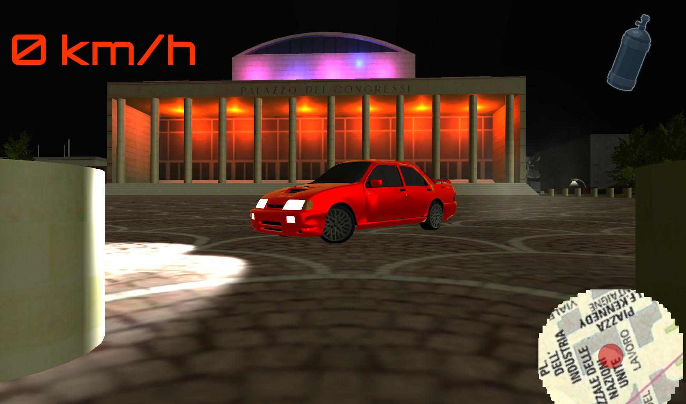

# Obbelisco

**Obbelisco** (roman malapropism of the word "obelisco" that means "obelisk" in English) is a car game developed by Marco Arena and a friend of him (who wants to stay anonymous) with [Unity3D](https://unity.com/). The game is inspired by the italian movie [*Velocità Massima*](https://it.wikipedia.org/wiki/Velocit%C3%A0_massima_(film)).

The game is set in Rome and specifically in the heart of [EUR](https://it.wikipedia.org/wiki/Europa_(Roma)), around *Marconi's Obelisk* in *piazza Marconi*. The neighborhood has been very roughly reconstructed with Blender, Google Maps, Google Images, and perseverance.

## Game features

-  the player can drive everywhere in the area, including some special places like *EUR Palasport* underground entrance, *Formula E track*, and inside some buildings
-  two vehicles inspired by the movie:
   - *Delta Integrale*
   - *Ford Sierra Cosworth* (playable in two fashions through the game: *damaged* ("Come l'alimenti, co' l'aflebo?") and *cleaned up* ("guarda un po' che robbetta")
-  *missions*: some of the key moments of the movie have been made playable as missions like:
   - *objects collection*: the player has to find and pick up some objects (the map gives some hints)
   - *race against time*: the player has to complete a race lap within a certain time
   - *race against opponent*: the player has to complete a race lap against an opponent
- after completing the first mission, the player can go back and forth to the workshop in *Ostia* and change some car settings (the workshop includes a track to test those changes)
- music and sounds
- configurable camera
- save and load of the game (everytime but during missions)
- teleportation (mostly used for debugging)
- refillable NOS

## Why the game is not public

Well, mostly because we don't really know if we can publish it...basically, we don't want to infringe any copyright issues (the movie, some textures taken from Google images, etc). However, the game is totally non-profit.

## Some shots

<figure>

  <figcaption>Palazzo della Cività Italiana (Colosseo Quadrato)<figcaption>
</figure>
    
  

<figure>

  <figcaption>Driving around Palazzo dei Congressi</figcaption>
</figure>

  

<figure>

  <figcaption>Eur Spa</figcaption>
</figure>

  

<figure>

  <figcaption>At the foot of Basilica dei santi Pietro e Paolo</figcaption>
</figure>

  

<figure>

  <figcaption>Having some fun on Satuday night</figcaption>
</figure>

  

<figure>

  <figcaption>Ostia workshop entrace</figcaption>
</figure>

  

<figure>

  <figcaption>When the car is not working...</figcaption>
</figure>

  

<figure>

  <figcaption>Eni</figcaption>
</figure>

  

<figure>

  <figcaption>Refuelling at IP</figcaption>
</figure>

  

<figure>

  <figcaption>Having some chat with other people at *Obbelisco*</figcaption>
</figure>

  

<figure>

  <figcaption>Velocità Massima cameo at Eurcine</figcaption>
</figure>

  

<figure>

  <figcaption>INAIL building</figcaption>
</figure>

  

<figure>

  <figcaption>via Cristoforo Colombo</figcaption>
</figure>

  

<figure>

  <figcaption>Ready for the mission?</figcaption>
</figure>

  

<figure>

  <figcaption>Having fun with some filters</figcaption>
</figure>
